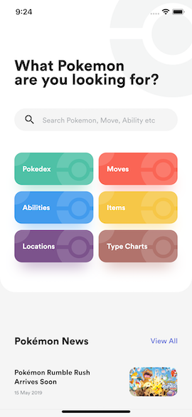
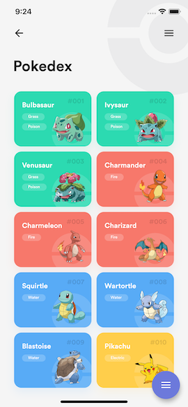
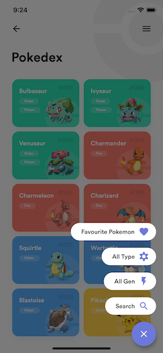
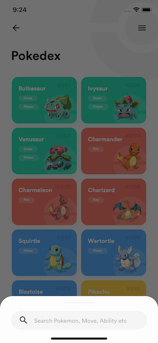
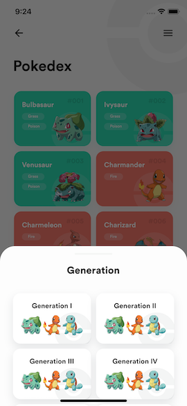
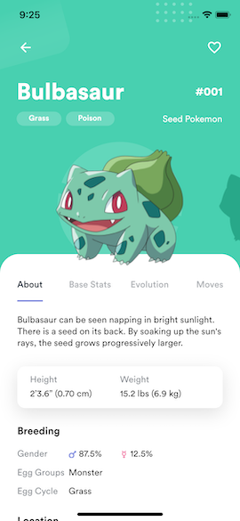
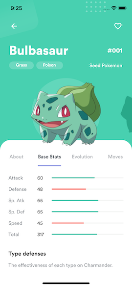
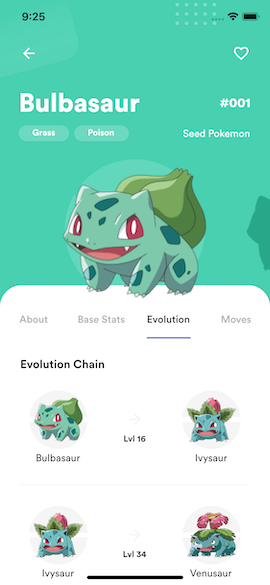

# Flutter Pokeapp

Pokeapp app built with Flutter

## App preview

")

## Todos

- [x] Home
- [ ] Home - Apply Sliver effect in home screen
- [x] Pokedex
- [x] Pokedex - FAB
- [x] Pokedex - Add FAB animation
- [ ] Pokedex - Add grid loading animation
- [x] Pokemon Info
- [x] Pokemon Info - About
- [x] Pokemon Info - Base Stats
- [x] Pokemon Info - Evolution
- [ ] Pokemon Info - Moves (no design)
- [x] Pokemon Info - Make tab area expandable
- [x] Pokemon Info - Add animations
- [ ] Pokemon Info - Add more Pokemons

